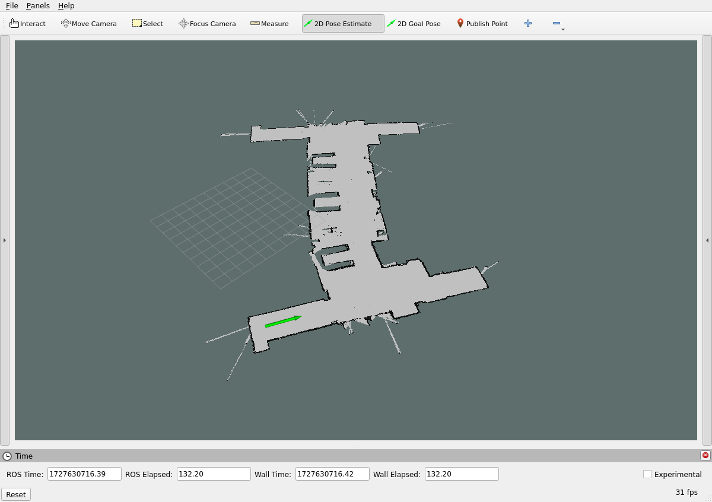

# Using real_data files

This folder contains all the material you would need to test your pf_localisation code against data collected from a real Pioneer 3DX. The data is unfiltered and will therefore present several challenges that come up when working with real (unsimulated) robots in the real world, such as sensor noise.

## Using the map server

For localising the robot, the map of the world has to be known. This can be published using the `map_server` in ROS 2, which can then be used by other nodes (such as your pf_localisation node, which is already set up to use the published map data).

For starting the map server, run

`ros2 run nav2_lifecycle_manager lifecycle_manager --ros-args -p node_names:=[map_server] -p autostart:=true`

and

`ros2 run nav2_map_server map_server --ros-args -p yaml_filename:=map.yaml`.

You can test if the map has started correctly by opening RViz2 (`ros2 run rviz2 rviz2` or simply `rviz2`), and adding a display for Map (set topic to `/map`) with Transient Local as the durability policy.

## Reading the recorded data

The folder contains 4 `trace[n]` rosbags (`n=0,1,2,3`). Each rosbag contains the recording of `/base_scan` (laser data) and `/odom` (odometry data) topics from the real robot collected while navigating different paths along the provided map.

To play back any bag file run `ros2 bag play <rosbag_path>`. In another terminal try listing the available topics (`ros2 topic list`) and try listening to each (`ros2 topic echo <topic_name>`).

*NOTE: The rosbag `trace0` is probably the best to start testing your algorithm with. It has simpler and slower motions, with mostly motion in straight lines and only a few rotational motions.*

## Localisation using in-built AMCL algorithm

ROS 2 has a native implementation of AMCL (Adaptive Monte-Carlo Localisation). This can be used as a baseline to compare the performance of your localisation algorithm.

To run the AMCL ROS 2 node:

- Run lifecycle manager: `ros2 run nav2_lifecycle_manager lifecycle_manager --ros-args -p node_names:=[amcl,map_server] -p autostart:=true`
- Start the map server with the provided map
- Run AMCL node: `ros2 run nav2_amcl amcl --ros-args --remap scan:=base_scan -p base_frame_id:=base_link`
- Start RViz2.
- Set the Fixed Frame to `map`.
- Add a Map view listening on the `/map` topic with Transient Local as the durability policy.
- Add a PoseWithCovariance view listening on the `/amcl_pose` topic.
- Finally, click the `2D Pose Estimate` button on the top bar on RViz, then draw an arrow on the map showing the approximate location and direction in which the robot is facing (see Figure below). This is the initial guess for the localisation algorithm (See note below).
- Now run any of the rosbags provided. This will provide the laser data and odometry measurements required by the localisation algorithm.

You should see the particle cloud move according to the present state of the AMCL algorihthm. Also note that AMCL publishes its best guess in the topic `/amcl_pose`. This can be viewed in RViz by adding a Pose or PoseWithCovariance view that subscribes to this topic. *NOTE: Your pf_localisation node will also publish a similar best guess which can be viewed in RViz2.*

## Regarding Initial Guess for the localisation algorithm

Depending on the implementation, the initial guess provided to the localisation algorithm is very important. Having no idea about the initialisation or starting with a very wrong initial guess falls under the "Kidnapped Robot" problem. You can try giving the wrong initial guess for AMCL, and see that it fails most of the time in the beginning, but may converge later on.
Recovering from a wrong initialisation and wrong localisation depends on how you implement your particle initialisation and resampling.

In all the provided traces, the robot's true starting pose is approximately the same (shown in Figure). However, to test the robustness of your algorithm to the "Kidnapped Robot" problem, you should also test with wrong initial poses.

### Note

**It is very likely that the parameters or parts of code that you used for the simualation data do not work with the real data, mainly due to the fact that the sensors are less perfect, and also may have completely different ranges. You may have to find a way to model/deal with noisy data from the sensors (which were not present in the simulation data). What other effects of noise do you observe in the provided dataset?**
